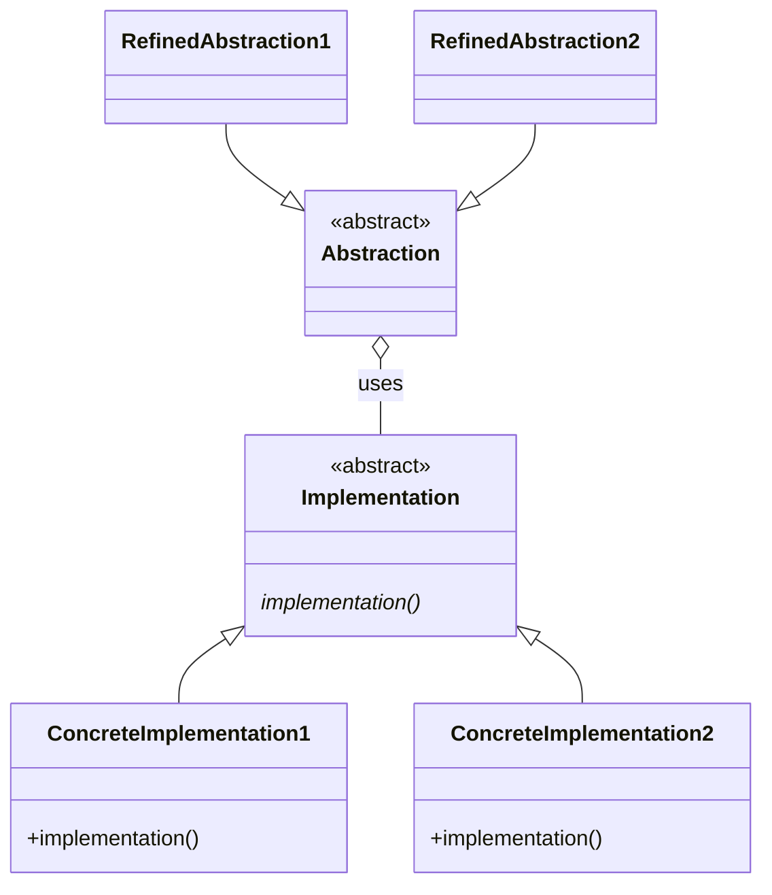
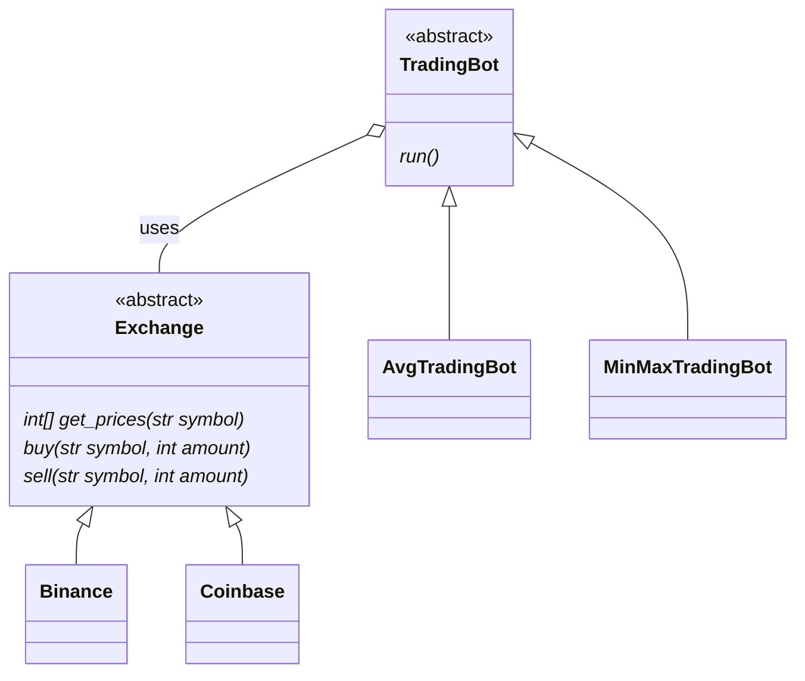

```mermaid
classDiagram
    class Abstraction {
        <<abstract>>
    }
    RefinedAbstraction1 --|> Abstraction
    RefinedAbstraction2 --|> Abstraction
    class Implementation {
        <<abstract>>
        implementation()*
    }
    Abstraction o-- Implementation : uses
    Implementation <|-- ConcreteImplementation1
    Implementation <|-- ConcreteImplementation2
    ConcreteImplementation1: +implementation()
    ConcreteImplementation2: +implementation()
```

```mermaid
classDiagram
    class Exchange {
        <<abstract>>
        int[] get_prices(str symbol)*
        buy(str symbol, int amount)*
        sell(str symbol, int amount)*
    }
    Exchange <|-- Binance
    Exchange <|-- Coinbase
    class TradingBot {
        <<abstract>>
        run()*
    }
    TradingBot o-- Exchange : uses
    TradingBot <|-- AvgTradingBot
    TradingBot <|-- MinMaxTradingBot
```
