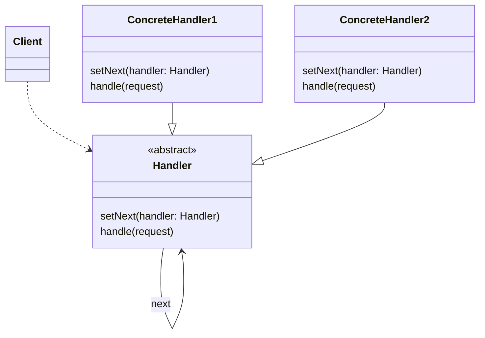
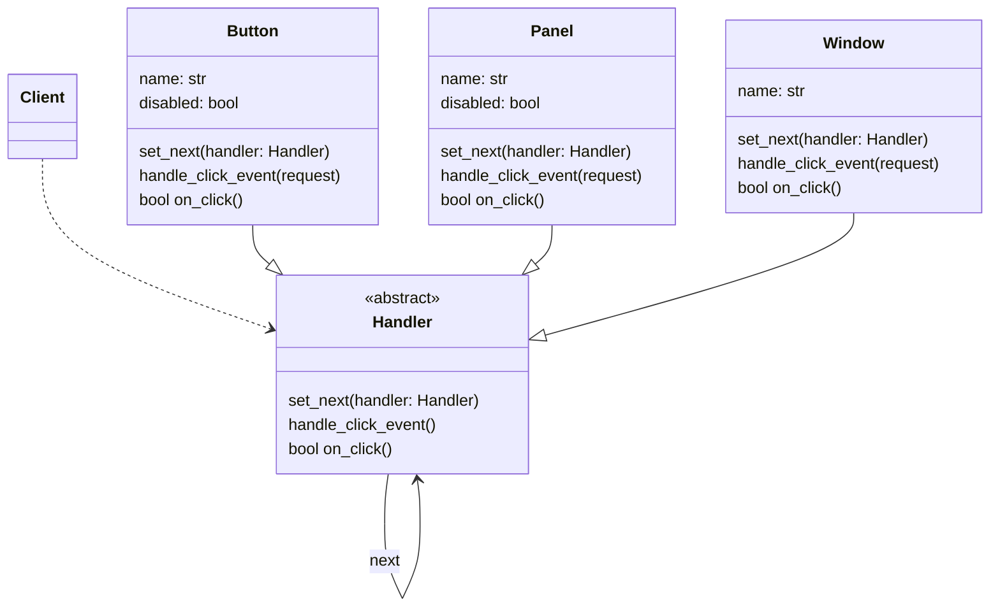

```mermaid
classDiagram
    Client ..> Handler
    class Handler {
        <<abstract>>
        setNext(handler: Handler)
        handle(request)
    }
    Handler --> Handler : next
    class ConcreteHandler1 {
        setNext(handler: Handler)
        handle(request)
    }
    class ConcreteHandler2 {
        setNext(handler: Handler)
        handle(request)
    }
    ConcreteHandler1 --|> Handler
    ConcreteHandler2 --|> Handler
```

```mermaid
classDiagram
    Client ..> Handler
    class Handler {
        <<abstract>>
        set_next(handler: Handler)
        handle_click_event()
        bool on_click()
    }
    Handler --> Handler : next
    class Button {
        name: str
        disabled: bool
        set_next(handler: Handler)
        handle_click_event(request)
        bool on_click()
    }
    class Panel {
        name: str
        disabled: bool
        set_next(handler: Handler)
        handle_click_event(request)
        bool on_click()
    }
    class Window {
        name: str
        set_next(handler: Handler)
        handle_click_event(request)
        bool on_click()
    }
    Button --|> Handler
    Panel --|> Handler
    Window --|> Handler
```
