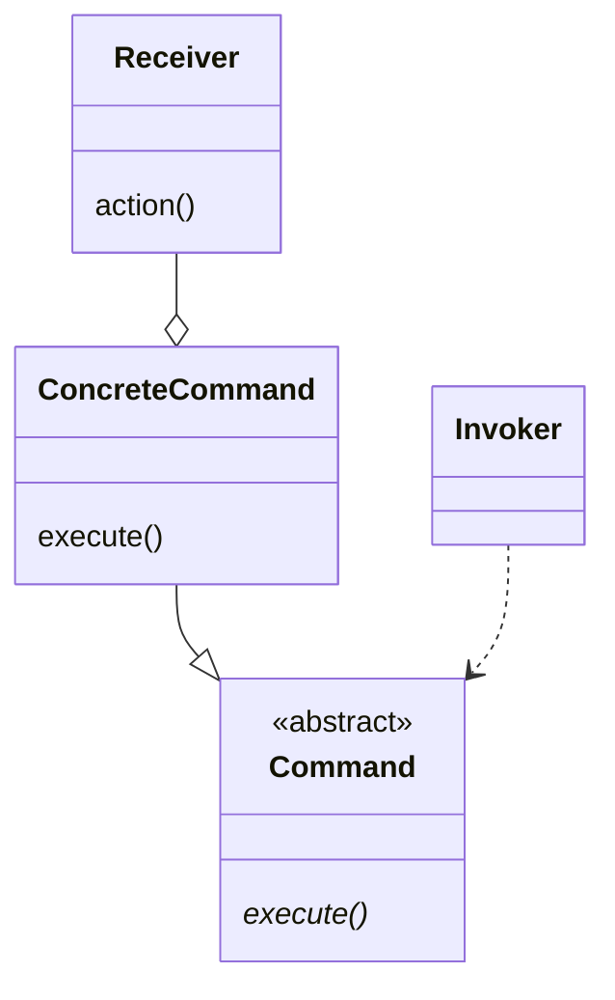
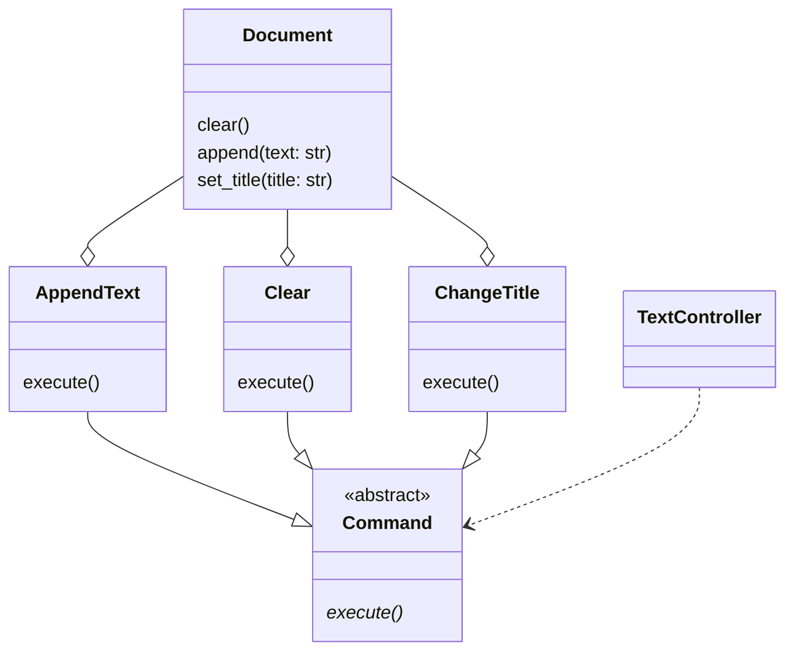

```mermaid
classDiagram
    class Command {
        <<abstract>>
        execute()*
    }
    class ConcreteCommand {
        execute()
    }
    class Receiver {
        action()
    }
    ConcreteCommand --|> Command
    Invoker ..> Command
    Receiver --o ConcreteCommand
```

```mermaid
classDiagram
    class Command {
        <<abstract>>
        execute()*
    }
    class AppendText {
        execute()
    }
    class Clear {
        execute()
    }
    class ChangeTitle {
        execute()
    }
    class Document {
        clear()
        append(text: str)
        set_title(title: str)
    }
    AppendText --|> Command
    Clear --|> Command
    ChangeTitle --|> Command
    TextController ..> Command
    Document --o Clear
    Document --o ChangeTitle
    Document --o AppendText
```
