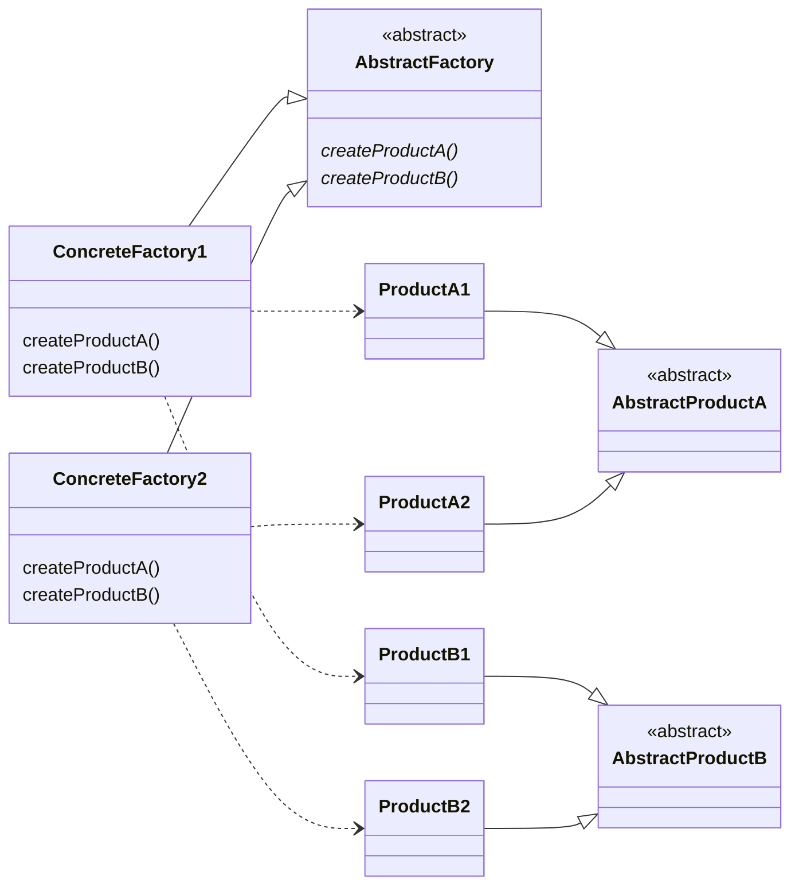
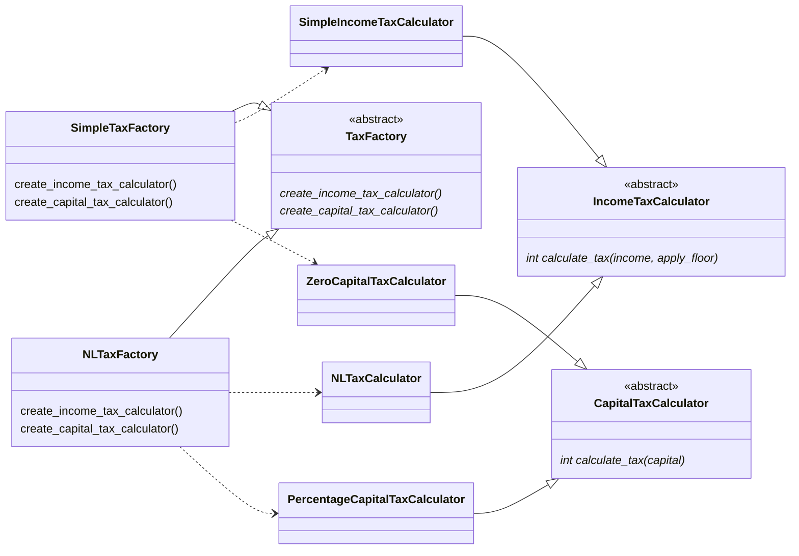

```mermaid
classDiagram
    direction LR
    class AbstractFactory {
        <<abstract>>
        createProductA()*
        createProductB()*
    }
    class ConcreteFactory1 {
        createProductA()
        createProductB()
    }
    class ConcreteFactory2 {
        createProductA()
        createProductB()
    }
    ConcreteFactory1 --|> AbstractFactory
    ConcreteFactory2 --|> AbstractFactory
    class AbstractProductA {
        <<abstract>>
    }
    ProductA1 --|> AbstractProductA
    ProductA2 --|> AbstractProductA
    class AbstractProductB {
        <<abstract>>
    }
    ProductB1 --|> AbstractProductB
    ProductB2 --|> AbstractProductB
    ConcreteFactory1 ..> ProductA1
    ConcreteFactory1 ..> ProductB1
    ConcreteFactory2 ..> ProductA2
    ConcreteFactory2 ..> ProductB2
```

```mermaid
classDiagram
    direction LR
    class TaxFactory {
        <<abstract>>
        create_income_tax_calculator()*
        create_capital_tax_calculator()*
    }
    class SimpleTaxFactory {
        create_income_tax_calculator()
        create_capital_tax_calculator()
    }
    class NLTaxFactory {
        create_income_tax_calculator()
        create_capital_tax_calculator()
    }
    SimpleTaxFactory --|> TaxFactory
    NLTaxFactory --|> TaxFactory
    class IncomeTaxCalculator {
        <<abstract>>
        int calculate_tax(income, apply_floor)*
    }
    SimpleIncomeTaxCalculator --|> IncomeTaxCalculator
    NLTaxCalculator --|> IncomeTaxCalculator
    class CapitalTaxCalculator {
        <<abstract>>
        int calculate_tax(capital)*
    }
    PercentageCapitalTaxCalculator --|> CapitalTaxCalculator
    ZeroCapitalTaxCalculator --|> CapitalTaxCalculator
    SimpleTaxFactory ..> SimpleIncomeTaxCalculator
    SimpleTaxFactory ..> ZeroCapitalTaxCalculator
    NLTaxFactory ..> NLTaxCalculator
    NLTaxFactory ..> PercentageCapitalTaxCalculator
```
