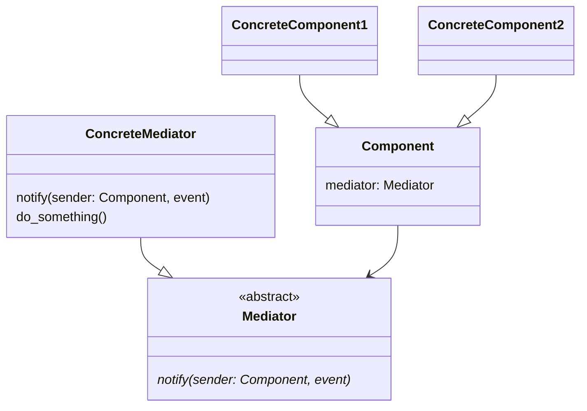
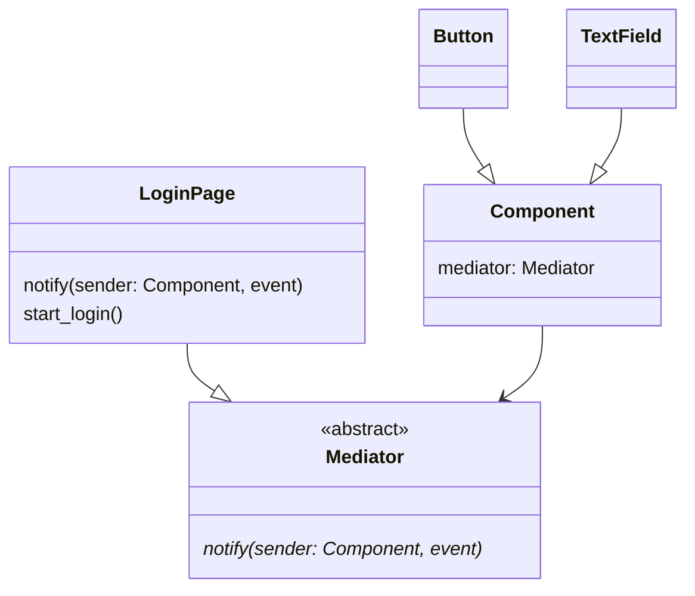

```mermaid
classDiagram
    class Mediator {
        <<abstract>>
        notify(sender: Component, event)*
    }
    class ConcreteMediator {
        notify(sender: Component, event)
        do_something()
    }
    class Component {
        mediator: Mediator
    }
    ConcreteMediator --|> Mediator
    ConcreteComponent1 --|> Component
    ConcreteComponent2 --|> Component
    Component --> Mediator
```

```mermaid
classDiagram
    class Mediator {
        <<abstract>>
        notify(sender: Component, event)*
    }
    class LoginPage {
        notify(sender: Component, event)
        start_login()
    }
    class Component {
        mediator: Mediator
    }
    LoginPage --|> Mediator
    Button --|> Component
    TextField --|> Component
    Component --> Mediator
```
