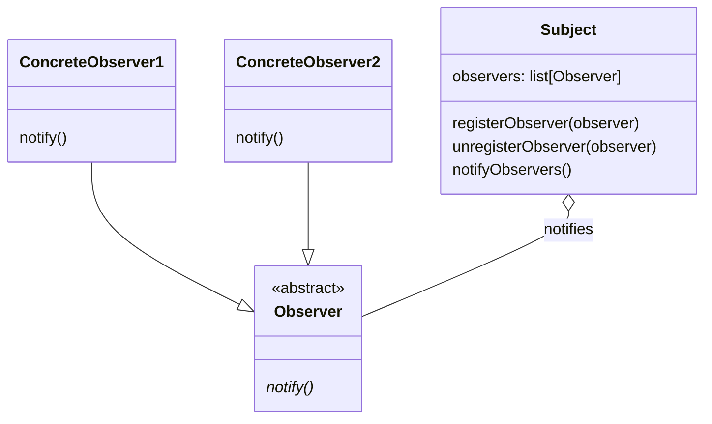

```mermaid
classDiagram
    class Observer {
        <<abstract>>
        notify()*
    }
    class ConcreteObserver1 {
        notify()
    }
    class ConcreteObserver2 {
        notify()
    }
    ConcreteObserver1 --|> Observer
    ConcreteObserver2 --|> Observer
    Subject o-- Observer : notifies
    class Subject {
        observers: list[Observer]
        registerObserver(observer)
        unregisterObserver(observer)
        notifyObservers()
    }
```
