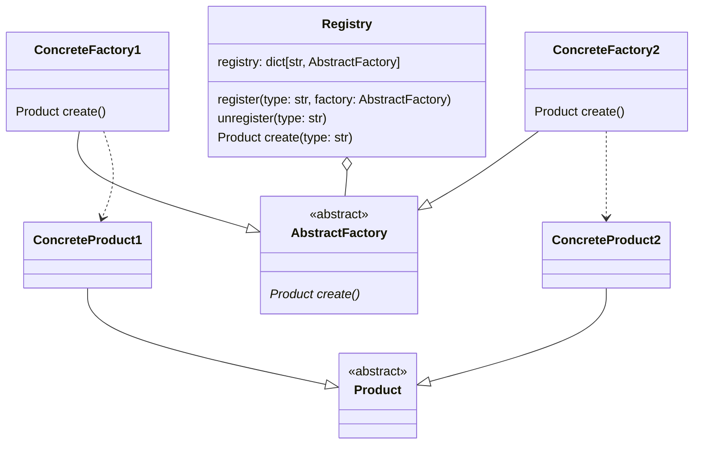
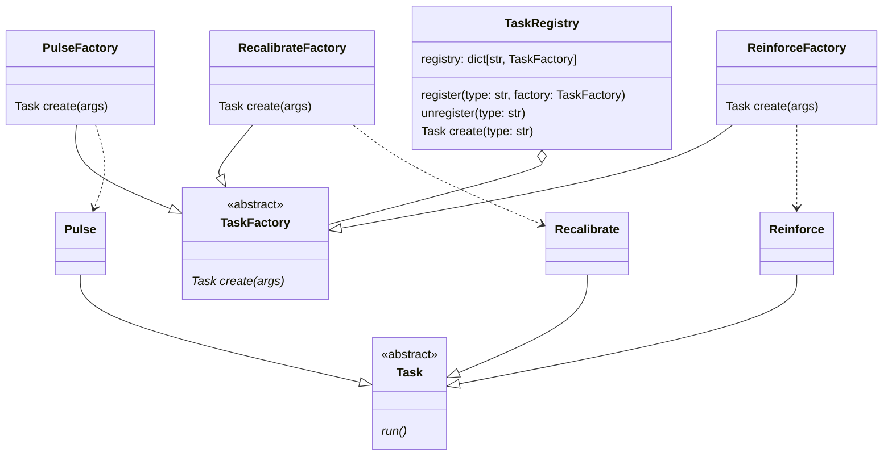

```mermaid
classDiagram

    class AbstractFactory {
        <<abstract>>
        Product create()*
    }
    class ConcreteFactory1 {
        Product create()
    }
    class ConcreteFactory2 {
        Product create()
    }
    class Product {
        <<abstract>>
    }
    class Registry {
        registry: dict[str, AbstractFactory]
        register(type: str, factory: AbstractFactory)
        unregister(type: str)
        Product create(type: str)
    }

    ConcreteFactory1 --|> AbstractFactory
    ConcreteFactory2 --|> AbstractFactory
    ConcreteProduct1 --|> Product
    ConcreteProduct2 --|> Product
    ConcreteFactory1 ..> ConcreteProduct1
    ConcreteFactory2 ..> ConcreteProduct2
    Registry o-- AbstractFactory
```

```mermaid
classDiagram

    class TaskFactory {
        <<abstract>>
        Task create(args)*
    }
    class PulseFactory {
        Task create(args)
    }
    class RecalibrateFactory {
        Task create(args)
    }
    class ReinforceFactory {
        Task create(args)
    }
    class Task {
        <<abstract>>
        run()*
    }
    class TaskRegistry {
        registry: dict[str, TaskFactory]
        register(type: str, factory: TaskFactory)
        unregister(type: str)
        Task create(type: str)
    }

    PulseFactory --|> TaskFactory
    RecalibrateFactory --|> TaskFactory
    ReinforceFactory --|> TaskFactory
    Pulse --|> Task
    Recalibrate --|> Task
    Reinforce --|> Task

    PulseFactory ..> Pulse
    RecalibrateFactory ..> Recalibrate
    ReinforceFactory ..> Reinforce
    TaskRegistry o-- TaskFactory
```
