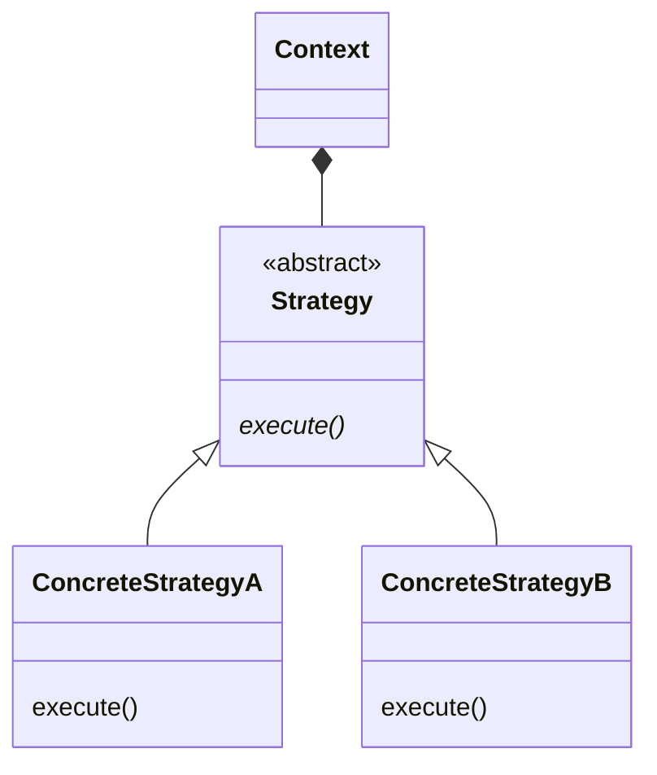
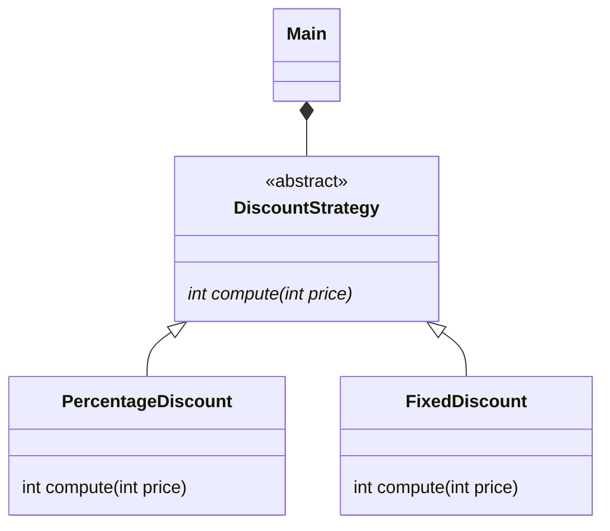

```mermaid
classDiagram
    class Context {

    }
    class Strategy {
        <<abstract>>
        execute()*
    }
    class ConcreteStrategyA {
        execute()
    }
    class ConcreteStrategyB {
        execute()
    }
    Strategy <|-- ConcreteStrategyA
    Strategy <|-- ConcreteStrategyB
    Context *-- Strategy
```

```mermaid
classDiagram
    class Main {

    }
    class DiscountStrategy {
        <<abstract>>
        int compute(int price)*
    }
    class PercentageDiscount {
        int compute(int price)
    }
    class FixedDiscount {
        int compute(int price)
    }
    DiscountStrategy <|-- PercentageDiscount
    DiscountStrategy <|-- FixedDiscount
    Main *-- DiscountStrategy
```
