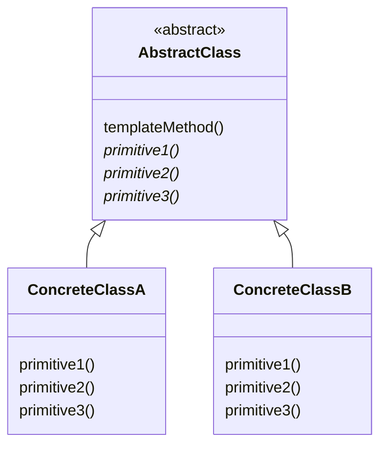
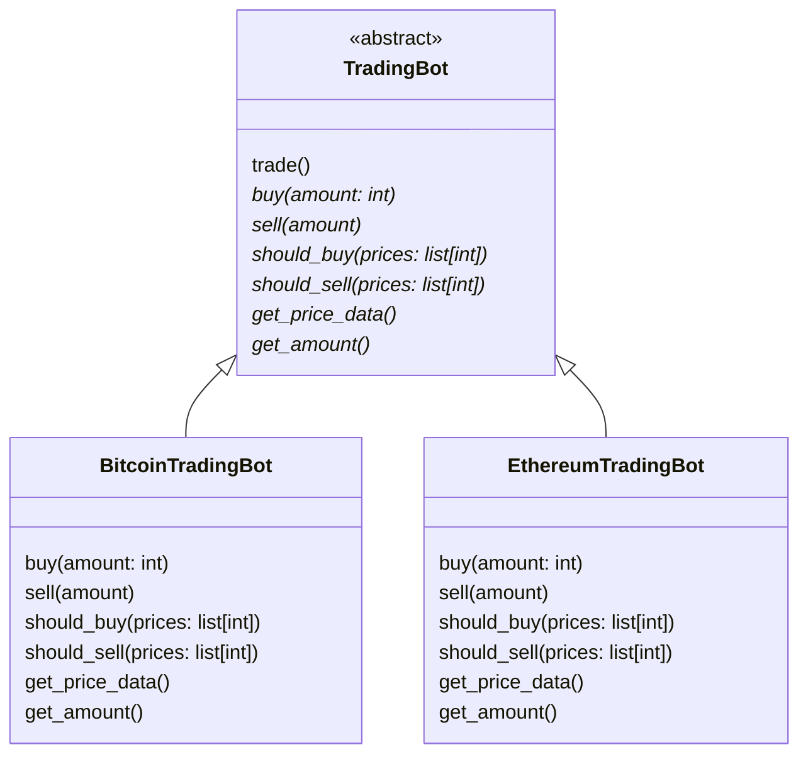

```mermaid
classDiagram
    class AbstractClass {
        <<abstract>>
        templateMethod()
        primitive1()*
        primitive2()*
        primitive3()*
    }
    class ConcreteClassA {
        primitive1()
        primitive2()
        primitive3()
    }
    class ConcreteClassB {
        primitive1()
        primitive2()
        primitive3()
    }
    AbstractClass <|-- ConcreteClassA
    AbstractClass <|-- ConcreteClassB
```

```mermaid
classDiagram
    class TradingBot {
        <<abstract>>
        trade()
        buy(amount: int)*
        sell(amount)*
        should_buy(prices: list[int])*
        should_sell(prices: list[int])*
        get_price_data()*
        get_amount()*
    }
    class BitcoinTradingBot {
        buy(amount: int)
        sell(amount)
        should_buy(prices: list[int])
        should_sell(prices: list[int])
        get_price_data()
        get_amount()
    }
    class EthereumTradingBot {
        buy(amount: int)
        sell(amount)
        should_buy(prices: list[int])
        should_sell(prices: list[int])
        get_price_data()
        get_amount()
    }
    TradingBot <|-- BitcoinTradingBot
    TradingBot <|-- EthereumTradingBot
```
